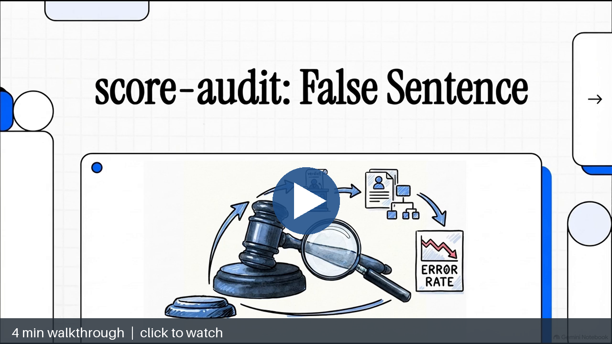
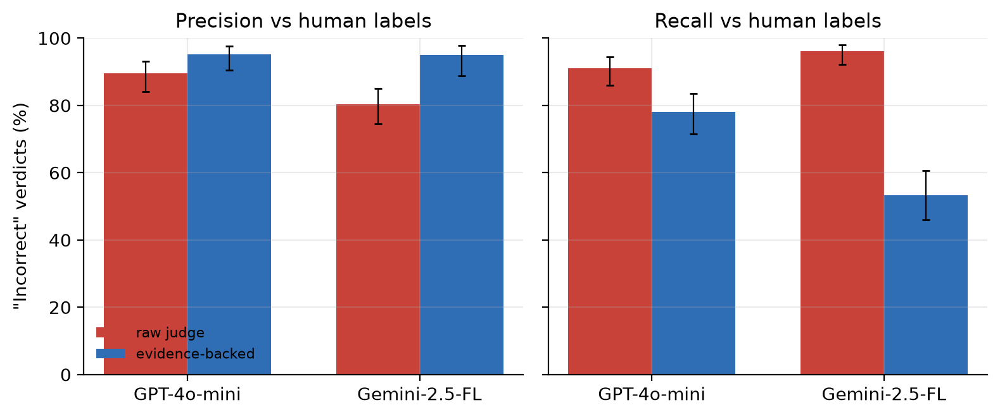
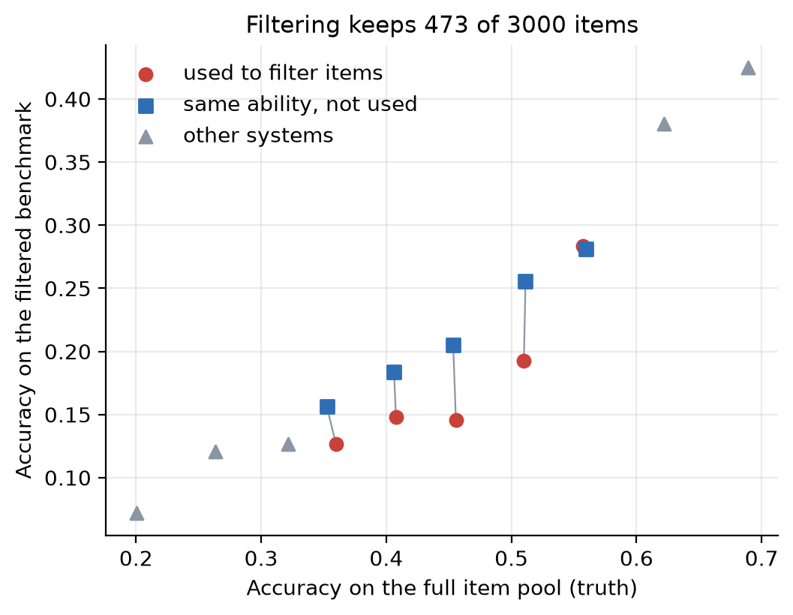
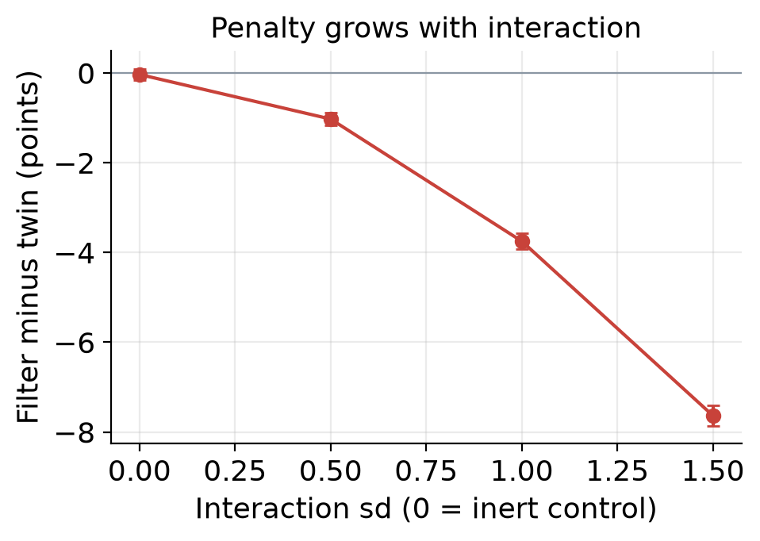
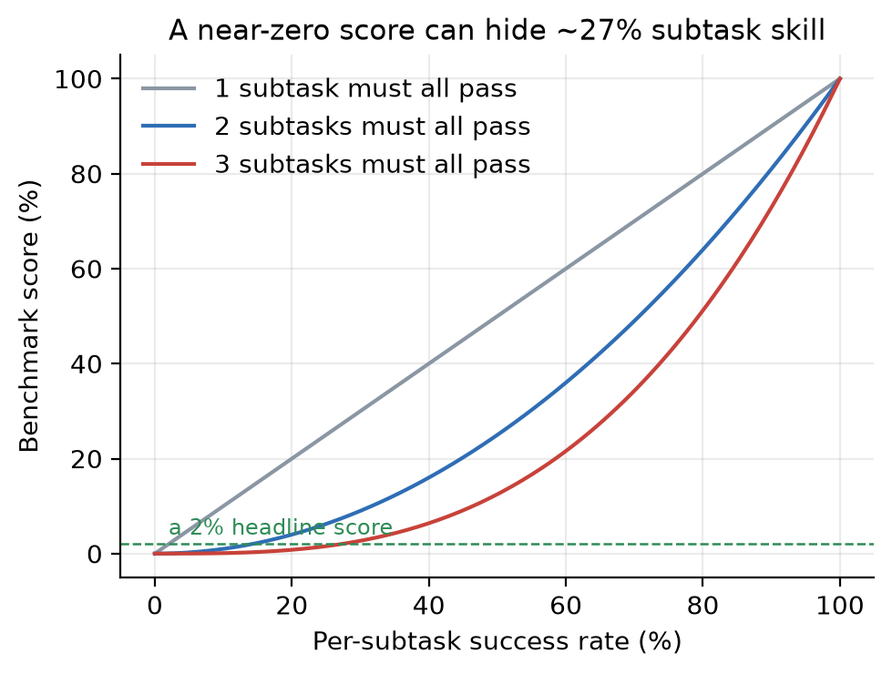
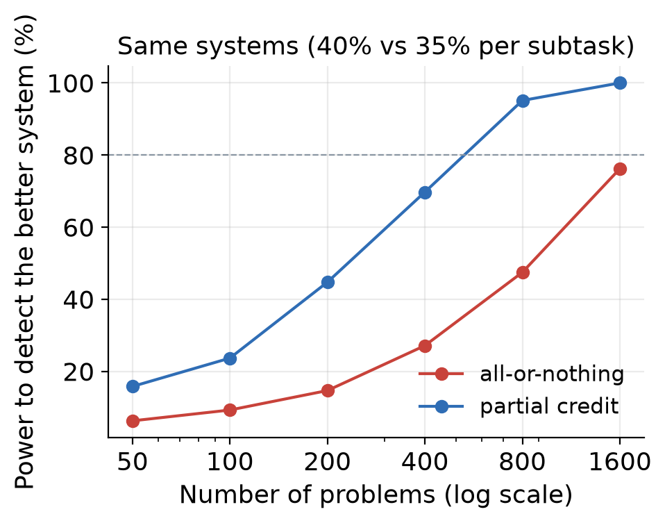
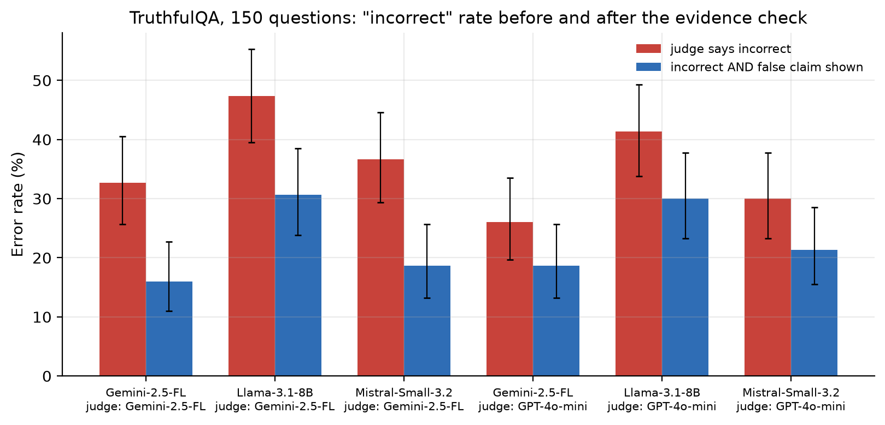
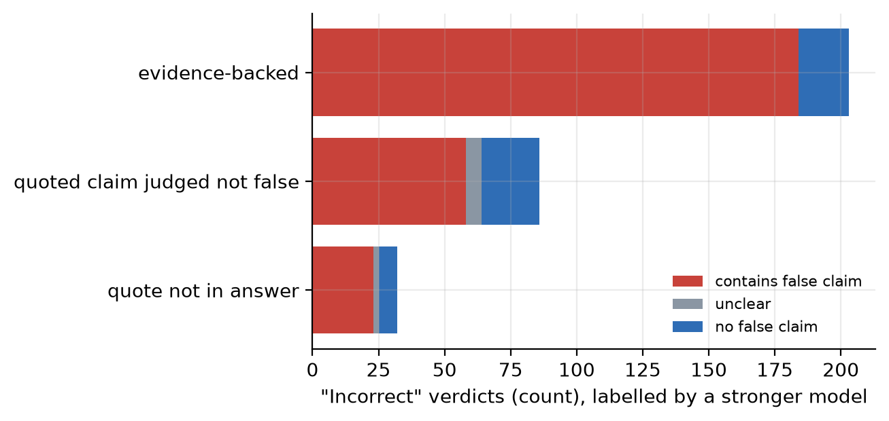

# score-audit

**Your LLM judge says a model is wrong. Can it show you the false sentence?**

Often it cannot. Against human labels, 1 in 10 to 1 in 5 of a judge's "incorrect" verdicts are wrong. Requiring the
judge to quote the false claim, and checking that quote, removes most of these false accusations.

[](media/score-audit_video.mp4)



| On 300 human-labelled TruthfulQA answers | Raw judge | With evidence check |
|---|---|---|
| False "incorrect" verdicts, GPT-4o-mini | 19 | **7** |
| False "incorrect" verdicts, Gemini-2.5-Flash-Lite | 42 | **5** |
| True errors still caught (GPT-4o-mini / Gemini) | 91% / 96% | 78% / 53% |

**Use it to:** flag unsupported "incorrect" verdicts for review, report judge precision and recall before trusting
an error rate, and compare judges on the same items. The check costs one extra short call per "incorrect" verdict.
With a small verifier, flag verdicts for review rather than overturning them: the check also drops some real errors.

## Try it on your own judge
```python
from score_audit.evidence_judge import Client, grade

g = grade(Client(), "openai/gpt-4o-mini", question, reference, known_false_answers, answer)
g["verdict"], g["false_claim"], g["quote_found"], g["claim_contradicts"], g["audited_verdict"]
```
Any OpenAI-compatible endpoint works (`OPENROUTER_API_KEY` or `OPENAI_API_KEY`). Every call is cached on disk.

## Two more ways a benchmark score misleads
Known-answer simulations, with an inert control arm:

- **Adversarial filtering under-ranks the models used to build the benchmark:** 3.7 points below an equal-ability
  twin on average. With no system-by-item interaction (the control), the gap is 0.0.
- **All-or-nothing scoring hides real gaps:** a 2% headline score can mean 27% per-subtask skill. On 400 problems a
  real 5-point gap is detected 27% of the time, against 70% with partial credit.

<details>
<summary>All figures and the stronger-model adjudication</summary>

| | |
|---|---|
|  |  |
|  |  |
|  |  |

On 450 new answers from three current models, 63% of 321 "incorrect" verdicts passed the evidence check. A
stronger model from a third family (Claude Haiku 4.5) confirmed a false claim in 82.6% of raw verdicts and 90.6%
of evidence-backed ones.
</details>

## Reproduce
```bash
uv sync && uv run pytest -q          # 9 tests, no API calls
uv run python experiments/exp4_human_labels.py   # runs offline from data/
```
Every number above comes from a script in `experiments/` and a CSV in `results/`. Figures are in PNG and PDF.

**Limits.** Experiments 1 and 2 are simulations. The human labels cover older, shorter model answers from the
TruthfulQA release. Single run per configuration, temperature 0.

TruthfulQA (Lin, Hilton and Evans, 2022) and its human labels are used under Apache-2.0. Code: MIT.
Author: Vahit FERYAD &lt;vahit.feryat@gmail.com&gt;
